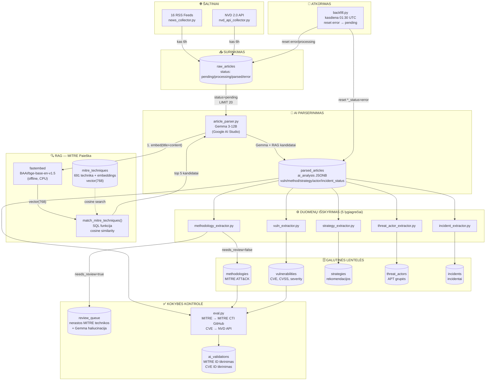

# Cyber Security Hub - Architecture

## Pilnas sistemos vaizdas



---

## Pipeline GitHub Actions

```
Kas 6 valandų:

collect ──────────────────────────────────┐
  news_collector.py (16 RSS)              │
                                          ├──► parse
nvd_collect ──────────────────────────────┘     article_parser.py
  nvd_api_collector.py                          + RAG (fastembed + pgvector)
                                                      │
                                              extract (×5 lygiagrečiai)
                                              vuln / method / strategy / actor / incident
                                                      │
                                                    eval
                                              MITRE + CVE validacija → ai_validations

Kasdiena 01:30 UTC:
  backfill.py → reset error eilės
```

---

## Duomenų srautas detaliai

```
raw_articles (status: pending)
    │
    ▼
article_parser.py
    │
    ├── 1. embed(title + content[:2000])
    │       ↓ fastembed BAAI/bge-base-en-v1.5
    │   query vector(768)
    │       ↓ match_mitre_techniques() SQL
    │   top 5 MITRE kandidatai
    │       ↓
    ├── 2. Gemma 3-12B gauna:
    │       - straipsnio tekstą
    │       - 5 MITRE kandidatus
    │       → grąžina JSON
    │
    ▼
parsed_articles
    ai_analysis: {
        summary, vulnerabilities, techniques,
        recommendations, threat_actors, incidents,
        rag_candidates: [T1566.001, ...]
    }
    │
    ├── techniques[needs_review=false] ──► methodologies ──► ai_validations
    ├── techniques[needs_review=true]  ──► methodologies
    │                                  ──► review_queue (+ gemma_suggestion)
    ├── vulnerabilities ───────────────► vulnerabilities ──► ai_validations
    ├── recommendations ───────────────► strategies
    ├── threat_actors ─────────────────► threat_actors
    └── incidents ─────────────────────► incidents
```

---

## Lentelės ir jų paskirtis

| Lentelė | Duomenys | Kur pildo |
|---|---|---|
| `raw_articles` | Surinkti straipsniai | news_collector, nvd_api_collector |
| `mitre_techniques` | 691 ATT&CK technika + embeddings | setup_mitre_embeddings.py (vienkartinis) |
| `parsed_articles` | AI analizė JSON | article_parser.py |
| `vulnerabilities` | CVE, CVSS, severity | vuln_extractor.py |
| `methodologies` | MITRE ATT&CK technikos | methodology_extractor.py |
| `strategies` | Saugumo rekomendacijos | strategy_extractor.py |
| `threat_actors` | APT grupės | threat_actor_extractor.py |
| `incidents` | Incidentai | incident_extractor.py |
| `review_queue` | Nerastos MITRE technikos | methodology_extractor.py |
| `ai_validations` | MITRE/CVE tikrinimo rezultatai | eval.py |

---

## Technologijų stack'as

| Komponentas | Technologija |
|---|---|
| DB | Supabase (PostgreSQL + pgvector) |
| AI modelis | Google Gemma 3-12B (AI Studio free tier) |
| Embedding | fastembed + BAAI/bge-base-en-v1.5 (offline) |
| Vektorių paieška | pgvector HNSW index |
| CVE duomenys | NVD 2.0 API |
| CI/CD | GitHub Actions (kas 6h) |
| Kalba | Python 3.12 |

---

## Limitai (Gemma free tier)

| Limitas | Reikšmė | Kaip tvarkoma |
|---|---|---|
| 30 RPM | 30 kvietimų/min | `DELAY_BETWEEN_REQ = 2.5s` |
| 1000 RPD | 1000 kvietimų/dieną | `check_daily_budget()` stops at 950 |
| 20 straipsnių/run | `BATCH_SIZE = 20` | 80 straipsnių/dieną |
