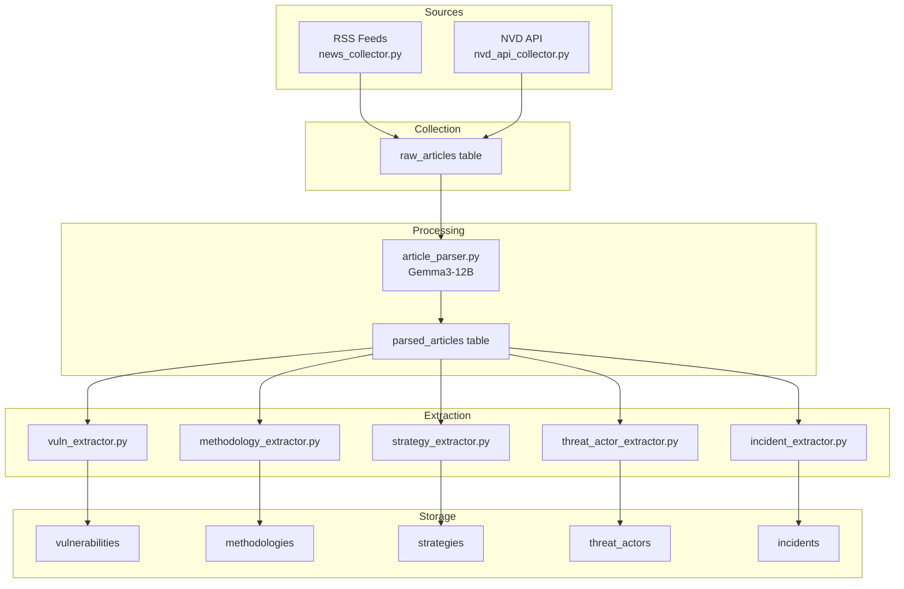
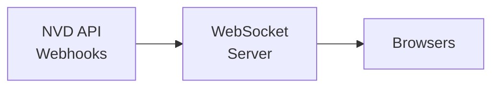

# Cyber Security Hub - Architecture

## Overview

This project automates collection, parsing, and extraction of cybersecurity intelligence from RSS feeds and APIs.

## Current Data Flow

## Pipeline Stages

| Stage | Script | Purpose | Frequency |
|-------|--------|---------|-----------|
| 1. Collect | `news_collector.py` | RSS feeds → raw_articles | Every 6 hours |
| 1b. Collect | `nvd_api_collector.py` | NVD API → raw_articles | Every 2 hours |
| 2. Parse | `article_parser.py` | raw_articles → parsed_articles (AI) | After collect |
| 3. Extract | `vuln_extractor.py` | parsed → vulnerabilities | After parse |
| 3. Extract | `methodology_extractor.py` | parsed → methodologies | After parse |
| 3. Extract | `strategy_extractor.py` | parsed → strategies | After parse |
| 3. Extract | `threat_actor_extractor.py` | parsed → threat_actors | After parse |
| 3. Extract | `incident_extractor.py` | parsed → incidents | After parse |

## Database Schema

### raw_articles
- Source: RSS feeds or NVD API
- Status: `pending` | `processing` | `parsed` | `error`
- `source_feed`: origin identifier (e.g., "nvd_cve", "nvd_api", "krebs")

### parsed_articles
- `ai_analysis`: JSON with AI-extracted structured data
- Status fields track extraction progress

### Final Tables
- `vulnerabilities` - CVEs, patches, affected products
- `methodologies` - MITRE ATT&CK techniques
- `strategies` - Security recommendations
- `threat_actors` - Threat groups
- `incidents` - Security incidents

## Technology Stack

| Component | Technology |
|-----------|------------|
| Database | Supabase (PostgreSQL) |
| AI Model | Google Gemma 3-12B |
| CVE Data | NVD 2.0 API |
| CI/CD | GitHub Actions |
| Language | Python 3.12 |

## Environment Variables

| Variable | Required | Purpose |
|----------|----------|---------|
| `SUPABASE_URL` | Yes | Database endpoint |
| `SUPABASE_KEY` | Yes | Service role key |
| `GEMINI_API_KEY` | Yes | Google AI Studio |
| `NVD_API_KEY` | No | NVD API (recommended) |

## Future Improvements

### 1. Real-time Streaming

### 2. Enhanced NVD Data
- Create dedicated `nvd_cves` table with full NVD schema
- Index by CVE ID, severity, CVSS score
- Store raw CVSS 3.1 metrics, CPEs, references

### 3. Additional Data Sources
- CISA Known Exploited Vulnerabilities (KEV) catalog
- EPSS (Exploit Prediction Scoring System)
- CWE (Common Weakness Enumeration) API
- Vendor security advisories

### 4. Analytics Dashboard
- Supabase dashboard for visualization
- CVE trends, severity distribution
- Top affected products
- Threat actor activity

### 5. Alerting System
- GitHub Issues for critical CVEs
- Email/Slack notifications
- Custom severity thresholds

### 6. Backfill Capabilities
- Historical NVD data import
- Batch processing for legacy data
